# Javascript-File-Server

A file server running node js on the back end

View the server <a href="https://file-server-xp39.onrender.com"  target="_blank">here</a>

## Usage

Once you visit <a href="https://file-server-xp39.onrender.com"  target="_blank">the web app</a>, the app routes to public/files which is the root path of the app.

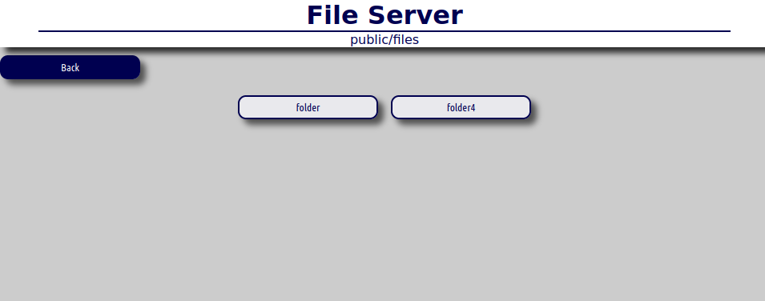

Directories have a blue border and files have no border.

<h3>Navigation</h3>

Right below the title, the current working directory is displayed. This can be useful for navigation or for copying or moving files.

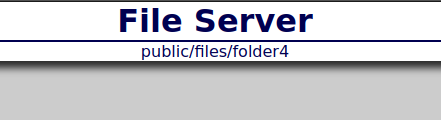
<h3>Context menu</h3>

To create a directory, or upload a file, right click anywhere on the body to get the context menu shown below:

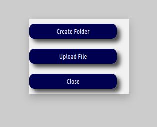

From the context menu, it's possible to create a directory or upload a file.

<h3>To create a directory:</h3>

The dialog below will appear when you select the "Create folder" option

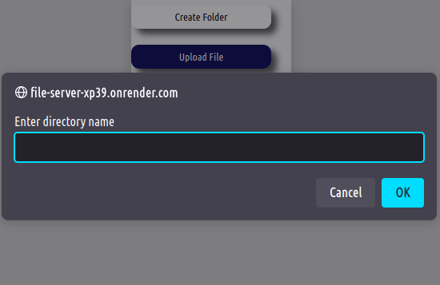

Just write the directory name on the dialog and press ok. The directory will be created in your current working directory

<h3>To upload a file:</h3>

Once you click on upload file, the following menu will appear

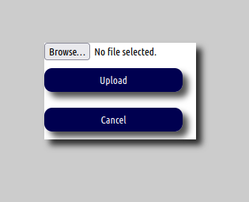

First click on the browse button, which should give you an option to select a file from your file system.  Once the file is loaded, click on upload to upload the file. Larger files may take some time to appear. Your connection speed may also affect the time taken.

<h3>File options</h3>

When you click on a file, the following menu will show up:

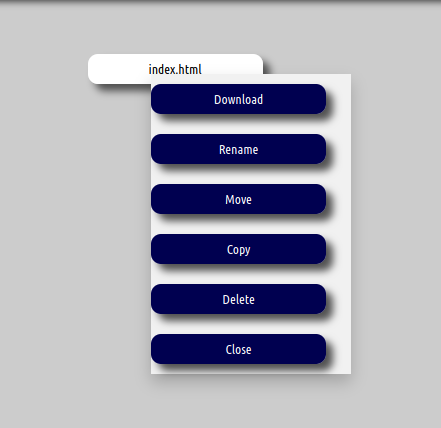

It has the options to:

<ul>
<li>Download</li>
<li>Renane</li>
<li>Move</li>
<li>Copy</li>
<li>Delete</li>
</ul>
<h3>To download a file:</h3>

Simply click on the download button. The download will start automatically

<h3>To rename a file:</h3>

Once you click on the "Rename" option, the following dialog will be shown:

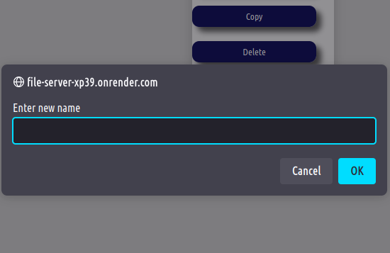

Enter the name you would like to rename the file to. Then click ok. The file should now appear with the new name.

<h3>To move a file</h3>

When you click on the "Move" option, the following dialog will be displayed

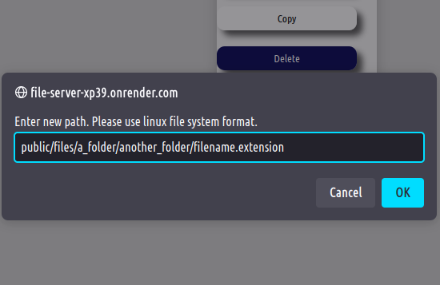

You will be required to write the full path you would wish to move the file to, as shown in the above image, ending the path with the name and extension of the file. Once you click ok. The file will be moved. Larger files may take some time to appear in the new location.

<h3>To copy a file</h3>

Once you click on the "Copy" option, the dialog below will be shown:

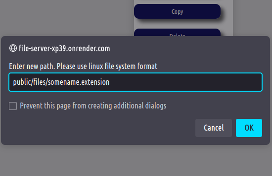

This is similar to the move function, but the original file is not altered. All the move steps apply here too.

<h3>To delete a file:</h3>

BE CAREFUL WITH DELETING FILES, THEY WILL NOT BE RECOVERABLE AFTER DELETION

Once you click on the delete option, the dialog below will appear:

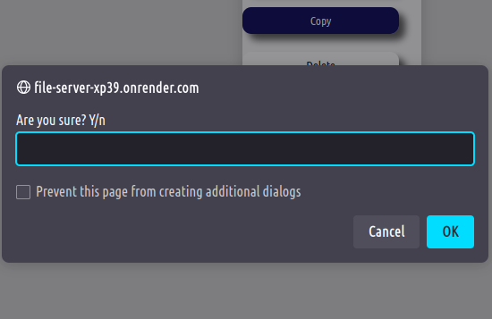

This is a dialog to confirm that you want to delete the file. Type "y" for yes and "n" for no. Be VERY sure you want to delete that file.

## IMPORTANT

As this file server is currently in development, there exists an error, whereby it is possible to navigate back from the root of the file system to the html,css and javascript for the server client side logic. Please DO NOT alter anything in this directory as this will break the website. This issue will be resolved in future updates.

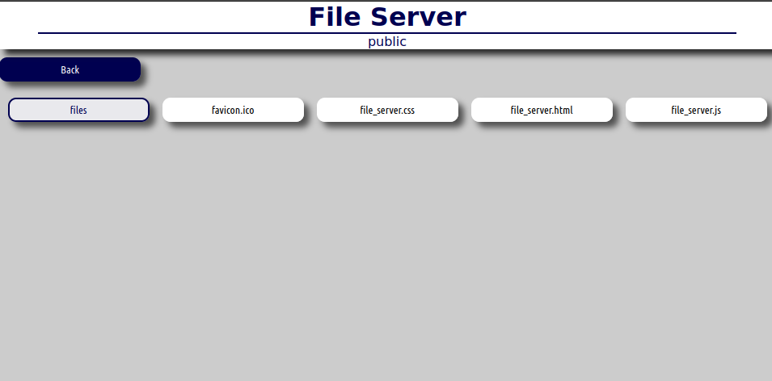

## Contributions

This is an open source project and all contribution is greatly appreciated. For more info, refer to the <a href="./documentation/CONTRIBUTION.md"> Contribution guide</a>
